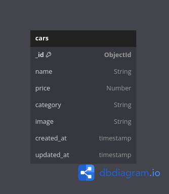

## Table of Contents

- [Database Diagram](#database-diagram)
- [Installation](#installation)
- [Dependencies](#dependencies)
- [API Documentation](#api-documentations)

## Database Diagram



## Installation

```sh
git clone "https://github.com/homurin/binar-challenge-04.git"
npm install
npm run dev
```

## Dependencies
